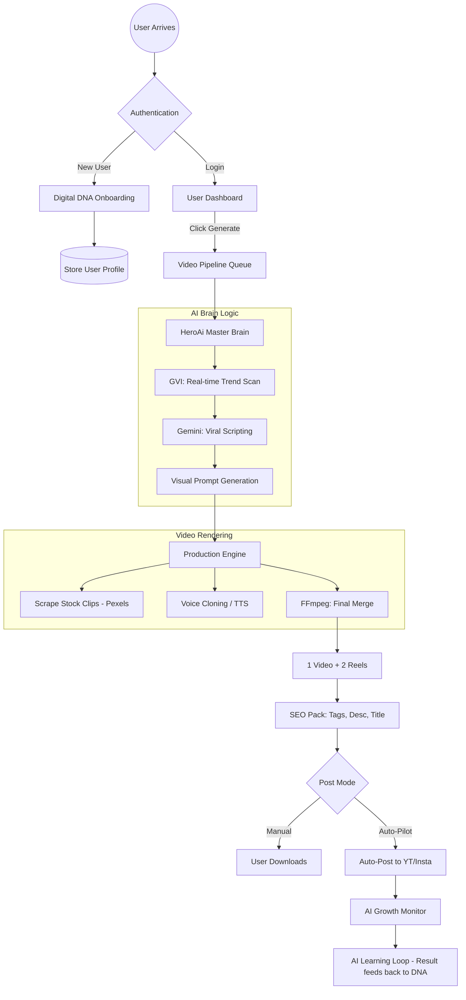

# 🌐 HeroAi — Full Project Script Flow Chart (हिंदी में)

HeroAi एक पूरी तरह से autonomous AI वीडियो प्रोडक्शन सिस्टम है। यह दस्तावेज़ आपको बताएगा कि HeroAi अंदरूनी तौर पर कैसे काम करता है, कौन सा हिस्सा कहाँ है, और डेटा का बहाव (flow) कैसे होता है।

---

## 📌 1. Master Flow Overview (बड़ा नज़रिया)

HeroAi का काम User के आने से लेकर Viral Video बनने तक इन 5 मुख्य चरणों में बटा हुआ है:

1.  **Identity & DNA**: User की पहचान और उसकी "Digital Identity" बनाना।
2.  **AI Brain (Thinking)**: AI तय करता है कि आज क्या Viral होगा।
3.  **Production Engine**: असल में वीडियो रेंडर (Render) करना।
4.  **Growth Monitor**: वीडियो डालने के बाद उसकी Performance देखना।
5.  **Monetization**: पैसे कमाने के अलग-अलग रास्ते (Subscription, Affiliate, Ads)।

---

## 🔄 2. Visual Flow Chart (प्रक्रिया का नक्शा)

---

## 🛠️ 3. Components का विवरण (कहाँ क्या है?)

### 📂 Frontend (UI Layer)
*   **`frontend/index.html`**: मुख्य लैंडिंग पेज।
*   **`frontend/auth.html`**: OTP आधारित लॉगिन सिस्टम।
*   **`frontend/setup.html`**: "Digital DNA" फॉर्म जहाँ यूजर अपनी Niche और Role चुनता है।
*   **`frontend/dashboard.html`**: मुख्य कंट्रोल सेंटर। यहीं से वीडियो जनरेट होता है।
*   **`frontend/admin/`**: एडमिन पैनल जहाँ से पूरा सिस्टम कंट्रोल होता है।

### 📂 Backend (Logic Layer)
*   **`backend/server.js`**: प्रोजेक्ट का एंट्री पॉइंट (Main Gate)।
*   **`backend/routes/engineRoutes.js`**: वीडियो जनरेशन की मुख्य API।
*   **`backend/services/AiBrainService.js`**: AI का "दिमाग" जो Gemini से बात करता है।
*   **`backend/services/FfmpegEngine.js`**: वीडियो बनाने वाला इंजन।
*   **`backend/services/BrowserAutomationService.js`**: अगर API फेल हो जाए तो ब्राउज़र से काम कराने वाला बैकअप।

### 📂 Database (Storage)
*   **`User Model`**: यूजर की सेटिंग्स और सब्सक्रिप्शन।
*   **`VideoPipeline Model`**: हर वीडियो का स्टेटस (Queued, Thinking, Rendering, Ready)।
*   **`AiVault Model`**: एडमिन द्वारा डाली गई API Keys का सुरक्षित भंडार।

---

## 🚀 4. Step-by-Step कार्यप्रविधि (How it Works)

### Step 1: User Onboarding (DNA Collection)
जब नया यूजर आता है, तो HeroAi उससे 7 सवाल पूछता है। इसे **Digital DNA** कहते हैं। 
*   **कहाँ?**: `frontend/setup.html`
*   **क्यों?**: ताकि AI को पता चले कि उसे किसके लिए वीडियो बनाना है (Business के लिए या Content Creator के लिए)।

### Step 2: AI Thinking (Brain at Work)
जब यूजर "Generate" दबाता है, तो `AiBrainService`:
1.  **GVI Service** से आज के Trending टॉपिक्स उठाता है।
2.  **Gemini AI** को प्रोम्प्ट भेजकर एक "High-Retention" स्क्रिप्ट लिखवाता है।
3.  वीडियो के हर सीन के लिए Visual Keywords (जैसे: "Happy person working") निकालता है।

### Step 3: Asset Gathering & Rendering
इंजन बैकग्राउंड में काम शुरू करता है:
1.  **Stock Clips**: Pexels API से फ्री वीडियो क्लिप्स डाउनलोड करता है।
2.  **Voiceover**: यूजर की अपनी आवाज (Voice Clone) या AI आवाज में स्क्रिप्ट बुलवाता है।
3.  **FFmpeg**: इन सबको जोड़कर, ऊपर से कैप्शंस (Subtitles) और बैकग्राउंड म्यूजिक डालता है।

### Step 4: Quality & SEO Check
वीडियो तैयार होने के बाद, AI उसके लिए:
*   Viral Title
*   SEO Description
*   Trending Hashtags
*   Viral Hook Analysis (वीडियो कितना वायरल होगा इसका स्कोर) तैयार करता है।

### Step 5: Delivery & Learning
*   अगर **Auto-Pilot** ऑन है, तो HeroAi खुद ही YouTube/Instagram पर पोस्ट कर देता है।
*   वीडियो के व्यूज (Views) देखकर AI सीखता है कि क्या काम किया और क्या नहीं, और अगली बार और बेहतर वीडियो बनाता है।

---

## 🔐 5. Admin & Safety (नियंत्रण)

*   **API Vault**: एडमिन `admin/vault.html` से नई API Keys जोड़ सकता है। अगर एक Key खत्म हो जाए, तो सिस्टम खुद दूसरी Key पर स्विच कर देता है (**Zero-Cost Routing**)।
*   **System Settings**: एडमिन पूरे ऐप को Maintenance मोड पर डाल सकता है या ग्लोबल लिमिट्स सेट कर सकता है।

---

> [!IMPORTANT]
> **HeroAi का मंत्र**: "Minimum Input, Maximum Virality." 
> यूजर को सिर्फ अपना टॉपिक या नीच (Niche) बतानी है, बाकी सारा काम (Scripting से Posting तक) AI खुद करेगा।

---
**HeroAi Flow Chart Folder: `/HeroAi flow/`**
इस फोल्डर में आप बाकी की विस्तृत रिपोर्ट्स (01-09) भी देख सकते हैं।
